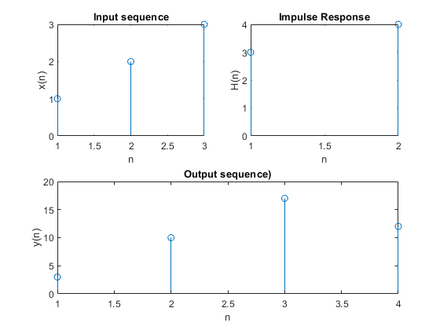

# Contents

1. [Experiment N0 01](#experiment-n0-01)
2. [Experiment Name](#experiment-name)
3. [Introduction](#introduction)
4. [Objectives](#objectives)
5. [Equipment Required](#equipment-required)
6. [Algorithm](#algorithm)
    6.1 [Direct Sum](#direct-sum)
    6.2 [Tabular Method](#tabular-method)
7. [Matlab Code](#matlab-code)
    7.1 [Direct Sum Approach](#direct-sum-approach)
    7.2 [Tabular Method](#tabular-method-code)
8. [Result & Discussion](#result--discussion)
9. [Conclusion](#conclusion)
10. [References](#references)

## Experiment N0 01
## Date of Experiment: 19/03/2023
## Experiment Name
Study of Linear Convolution and Implementation using MATLAB code.

## Introduction
The Discrete-Time Convolution (DTC) is an essential operation in discrete-time signal analysis. The operation relates the output sequence y(n) of a linear-time invariant (LTI) system to the input sequence x(n) and the unit sample sequence h(n). In this experiment, convolution was manually computed using MATLAB instead of the built-in function 'conv'.

## Objectives
The main objectives of this experiment were:
- To find the convolution of the input sequence
- To develop an algorithm to find convolution without using the 'conv' function

## Equipment Required
MATLAB

## Algorithm

### Direct Sum
1. Constructed input sequences X(n) and input response H(n) functions.
2. Used nested loops to iterate through n and k, where n is the total length and k is the length of x.
3. Multiplyed the two sequences element-wise and store the sum in y(n).

### Tabular Method
1. Constructed input sequences X(n) and input response H(n) functions.
2. For each n, multiplyed h(n) and x(k) to form a matrix A.
3. Used nested loops to compute the output sequence y(n) by adding diagonal elements of matrix A.

## Matlab Code

### Direct Sum Approach
```matlab
% MATLAB code for direct sum approach
x = input('Enter x: ');
h = input('Enter h: ');
xl = length(x);
hl = length(h);
X = [x, zeros(1, xl)];
H = [h, zeros(1, hl)];
y = zeros(1, xl + hl - 1);

for n = 1 : xl + hl - 1
    for k = 1 : xl
        if n - k + 1 > 0
            y(n) = y(n) + X(k) * H(n - k + 1);
        end
    end
end
```
### Tabular Method
```matlab
% MATLAB code for tabular method
x = input('Enter x: ');
h = input('Enter h: ');
len = length(x);
A = [];
y = [];

for n = 1 : len
    g = h(n) .* x;
    A = [A; g];
end

n = 1;
```

## Result & Discussion
## Plotting of output signal


### Figure: Graphical Plot of output signal


## Conclusion
The experiment was successful, and we did not encounter any errors while running the MATLAB code.

## References
[1] Discrete Time Convolution Properties — Discrete Time Signal, 11 2017.
```
https://www.gaussianwaves.com/2014/02/survey-of-methods-to-compute-convolution/
```