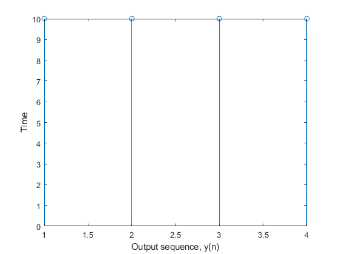
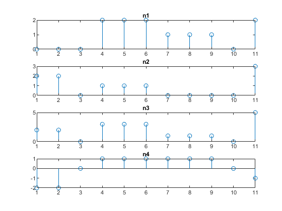
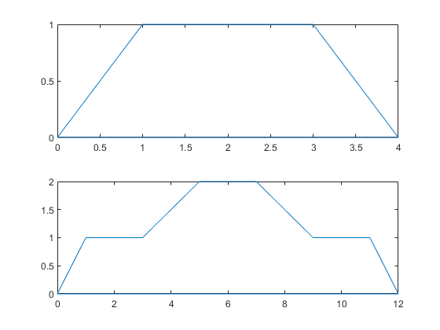

# Experiment N0 02
## Date of Experiment: 03/04/2023
## Experiment Name
1. Study of Circular Convolution and Implementation using **MATLAB** code.
2. Plotting the figure of given two signals & summation and subtraction of them using **MATLAB** code.
3. Plotting the given two signals in one figure using **MATLAB** code.

## Introduction
Circular convolution is "the fundamental operation to compute discrete time signals." Considering two finite sequence periodic discrete-time signals with length N are x1[n], x2[n], the periodic convolution of these two discrete signals is. [@libretexts-2022] The operation relates the output sequence y(n) of a linear-time invariant (LTI) system, with the input sequence x(n) and the unit sample sequence h(n), as shown in Fig. 1. In this experiment, we found convolution manually instead of using the built-in function `ifft` in **MATLAB**.
The formula for convolution is:
\[ y(n) = \sum_{m=1}^{N-1}x1(k)*x2(n-m) \]
The shifting in this operation is a circular shifting. In this experiment, we had implemented circular convolution using **MATLAB** code. There are two methods to determine circular convolution. They are,
- Concentric circle method
- Matrix multiplication method.


# Objectives
The main objectives of these experiments were:

- To find the convolution of the input sequence.
- To develop an algorithm to find convolution without using the `ifft` function.


# Equipment Required
**MATLAB**
# Algorithm
## Matrix Multiplication Method:
- **Step 1:** The NXN matrix is formed by repeating one of the sequences. This is then achieved by making a circular shift of one sample.
- **Step 2:** Then the second sequence forms a column matrix.
- **Step 3:** Finally, the result of circular convolution is calculated by multiplying these two matrices.

# Matlab Code
Here is the input code of convolution.

## Circular Convolution using Matrix Method
```matlab
a=[1 2 3 4]
b=[]
c=[zeros(1,4)]
d=[zeros(1,4)]
k=4;
b(1)=a(k);
for i=1:1:3
    b(i+1)=a(i);
end
c(1)=b(k);
for i=1:1:3
    c(i+1)=b(i);
end
d(1)=c(k);
for i=1:1:3
    d(i+1)=c(i);
end
A=[a;b;c;d]
A=A.'
h=[1 1 1 1]
conv=h*A
stem(conv);
```

## Summation-Subtraction
```matlab
clc;
clear all;
n1=[0 0 0 2 2 2 1 1 1 0 2];
n2=[2 2 0 1 1 1 0 0 0 0 3];
m=length(n1);
subplot(4,1,1)
stem(n1)
title('n1')
subplot(4,1,2)
stem(n2)
title('n2')
subplot(4,1,3)
stem(n1+n2)
title('n3')
subplot(4,1,4)
stem(n1-n2)
title('n4')
```

## Plotting Two Signals in One Figure
```matlab
h = 1 ;  % height 
a = 2 ;  % top side
b = 4 ;   % base
h2 = 2 ;  % height 
%%Frame vertices
A = [0 0] ;
B=[3*b,0];
C = [0.5*(b-a)+a+2*b h] ;
D = [2*b+0.5*(b-a) h] ;  
E=[2*b-0.5*(b-a) h2];
F=[b+0.5*(b-a) h2];
G=[b-0.5*(b-a) h]
H=[0.5*(b-a) h]
coor=[A;B;C;D;E;F;G;H;0 0];
coor1=[A;4 0;3 1;1 1;0 0]
subplot(2,1,1)
plot(coor1(:,1), coor1(:,2))
subplot(2,1,2)
plot(coor(:,1), coor(:,2))
```

# Result & Discussion
Here is the outcome of the above code.

## Circular Convolution

Figure: Graphical Plot of output sequence y(n).

## Summation-Subtraction of Signals

Figure: Graphical Plot of n1, n2, n1+n2, n1-n2 signals.

## Plotting Two Signals in One Figure

Figure: Graphical Plot of signal1 & signal2

The outcomes of this experiment were achieved as desired i.e. the circular convolution of input signals using the matrix method. The matrix multiplication approach handled periodic input signals by circular shifting method. For example, for N length input, the shifting was done N-1 times. After each shifting, the shifted values are stored in another array. Thereby, there are N number of arrays where each array has N number of elements. The matrix formed using this array is of N*N size. By transposing them this matrix, the actual matrix needed was formed. And finally using matrix multiplication of this matrix with another column matrix, the result obtained. To draw the trapezoidal signal all the angular points were determined and then plotted.

# Discussion
## Conclusion
The experiment was successful, and we did not encounter any errors while running the **MATLAB** code.


# References
[@libretexts-2022]: Circular Convolution. (2022).
Retrieved from [https://phys.libretexts.org/Bookshelves/Modern\_Physics/Book\%3A\_Fundamentals\_of\_Modern\_Physics\_(I\_Okon\_and\_S\_Osinowo)/12\%3A\_Signal\_Processing\_and\_Computational\_Physics/12.10\%3A\_Circular\_Convolution](https://phys.libretexts.org/Bookshelves/Modern_Physics/Book%3A_Fundamentals_of_Modern_Physics_(I_Okon_and_S_Osinowo)/12%3A_Signal_Processing_and_Computational_Physics/12.10%3A_Circular_Convolution)
