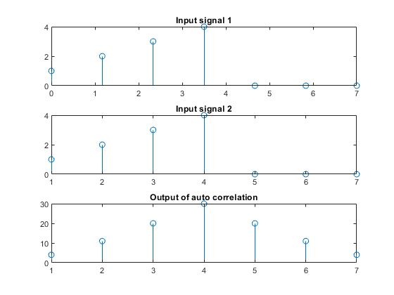
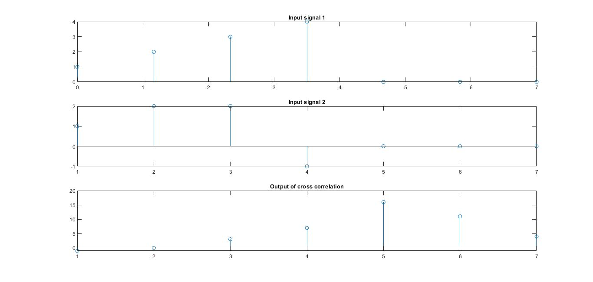
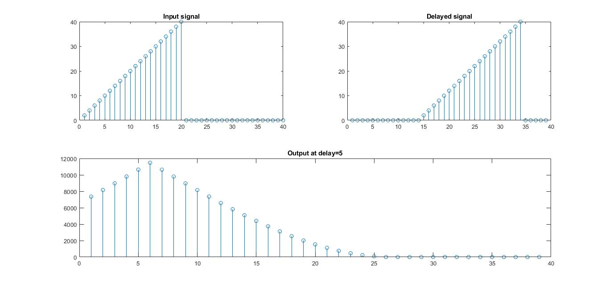

# Experiment N0 03
## Date of Experiment: 10/04/2023
## Experiment Name
1. Study of Auto-correlation using **MATLAB** code.
2. Study of Cross-correlation using **MATLAB** code.
3. Study of identifying delay of a function using correlation.

## Introduction
Correlation coefficient is a measure of how well two signals are related to each other in terms of their similarity, alignment, and dependence. It is widely used in digital signal processing (DSP) for various purposes, such as signal detection, estimation, compression, enhancement, and classification. [@unknown-author-2017]

### Auto Correlation
The auto-correlation function of a signal is defined as the measure of similarity or coherence between a signal and its time-delayed version. Thus, auto-correlation is the correlation of a signal with itself.

### Cross Correlation
In signal processing, cross-correlation is a measure of the similarity of two series as a function of the displacement of one relative to the other. This is also known as a sliding dot product or sliding inner product. It is commonly used for searching a long signal for a shorter, known feature.

### Application of correlation: Identifying delay
In correlation, if the correlation between a signal and its delayed copy is calculated, then the maximum magnitude will be obtained at a delayed time. That is, the peak of the correlation function occurs at the lag with the best similarity between the two signals, i.e., the estimated delay.

# Objectives
The main objectives of this experiment were:

- To find the autocorrelation and cross-correlation of the input sequence without using the built-in function `xcorr()`.
- To develop an algorithm to identify the delay time of a given function.

# Equipment Required
**MATLAB**


# Matlab Code
Here is the input code of the above experiments.

## Auto Correlation
```matlab
clc;
clear all;
x=input('X ');
m1=length(x);
len=2*m1-1;
y=[x,zeros(1,(m1-1))];
n=len;
while(n>=1)
    r(len-n+1)=0;j=n;i=m1;
    while(i>=1 && j>=1)
        r(len-n+1) = r(len-n+1)+x(i)*y(j);
        j=j-1;  i=i-1; 
    end
   n=n-1;
end
```

## Cross Correlation
```matlab
clc;
clear all;
x=input('X ');
y=input('Y ');
m1=length(x);
m2=length(y);
len=m1+m2-1;
y=[y,zeros(1,(m1-1))];
n=len;
while(n>=1)
    r(len-n+1)=0;j=n;i=m1;
    while(i>=1 && j>=1)
        r(len-n+1) = r(len-n+1)+x(i)*y(j);
        j=j-1;  i=i-1; 
    end
   n=n-1;
end
```

## Identifying Delay
```matlab
clc;
clear all;
t=1:1:20;
x=2*t;
m1=length(x);
len=2*m1-1;
delay=input('delay: ');
n=len;
y=[zeros(1,m1-1-delay), x, zeros(1,delay)];
while(n>=1)
    r(len-n+1)=0;j=n;i=m1;
    while(i>=1 && j>=1)
        r(len-n+1) = r(len-n+1)+x(i)*y(j);
        j=j-1;  i=i-1; 
    end
   n=n-1;
end
```

# Result & Discussion
Here is the outcome of the above code.

## Output of Auto Correlation

- **Figure3.1**: Graphical Plot of autocorrelation

## Output of Cross Correlation

- **Figure3.2**: Graphical Plot of crosscorrelation

## Plotting for Identifying Delay Signal

- **Figure3.3**: Graphical Plot delay signal

The outcomes of this experiment were achieved as desired. For both the auto and cross-correlation, we used the same lines of code except a second input sequence was taken for cross-correlation. At first, we shifted one of the input sequences n-1 times where n is the length of the signal. As the array index cannot be zero or negative, we shifted the signal by inserting zeros at the end, which gave the padding effect. The input sequences were added with the corresponding value. Then this signal was shifted to the right one by one and kept repeating the previous step.
For identifying the delay time of a signal, we used the above correlation method where a second signal was generated by delaying the input signal. And the delay was included by adding zeros from the beginning of an array for padding. We observed that the peak value was obtained at the time of delay from Figure [^delay].


# Conclusion
The experiment was successful, and we did not encounter any errors while running the **MATLAB** code.
# References
[^delay]: Reference to the figure labeled as "Graphical Plot delay signal."
[@unknown-author-2017]: Understanding Correlation - Technical Articles. (2017, January). **Available** [https://www.allaboutcircuits.com/technical-articles/understanding-correlation/](https://www.allaboutcircuits.com/technical-articles/understanding-correlation/)

