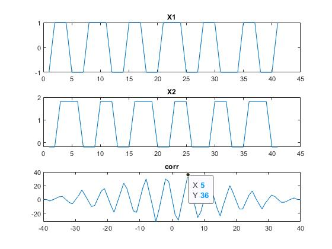

# Experiment N0 04
## Date of Experiment: 17/05/2023
## Experiment Name
Study of Identifying delay using correlation.
## Introduction
In correlation, if the correlation between a signal & its delayed copy is calculated then the maximum magnitude will be obtained at a delayed time. That is, the peak of the correlation function occurs at the lag with the best similarity between the two signals, i.e. the estimated delay. [1]

# Objectives 
The main objectives of this experiment were:

- To develop an algorithm to identify the delay time of a given function.


# Equipment Required
**MATLAB**

# MATLAB Code
Here is the input code of the above experiment -

## Identifying Delay
```matlab
A=0.3171;
t=-20:1:20;
x1=square(3*A*t);
noise=rand();
x2=square(3*A*(t+5))+noise;
[corr,t]=xcorr(x1,x2)
mag=max(corr(:))
delay=find(corr(:)==mag);
if delay>40
    k=delay-41;
end
if delay<40
    k=40-delay;
end
```
# Result & Discussion
Here is the outcome of the above code -
## Plotting for identifying delay signal

- Figure: Graphical Plot delay signal

The outcomes of this experiment were achieved as desired. We used the correlation method to identify the delay time of a signal, where a second signal was generated by delaying the input signal. And the delay was included by adding zeros from the beginning of an array for padding. We observed that the peak value was obtained at the time of delay from Fig. [^delay].

# Conclusion
The experiment was successful & we did not encounter any errors while running the **MATLAB** code.
# Refernces
[^delay]: Reference to the figure labeled as "Graphical Plot delay signal."
[@unknown-author-2017]: Understanding Correlation - Technical Articles. (2017, January). Retrieved from [https://www.allaboutcircuits.com/technical-articles/understanding-correlation/](https://www.allaboutcircuits.com/technical-articles/understanding-correlation/)

